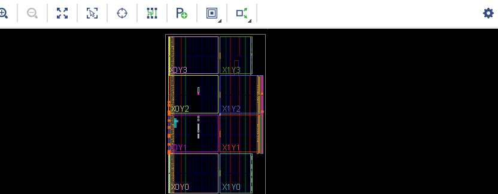

# Lab 2: Four-Digit Hex Counter

* Build a four-digit (16-bit) counter to display its value on 7-segment displays (See Section 9.1 Seven-Segment Display of the [Refenece Manual](https://reference.digilentinc.com/_media/reference/programmable-logic/nexys-a7/nexys-a7_rm.pdf))

* Created a new RTL project
* Run Synthesis
* Run Implementation
* Open Implemented Design

* Program Device

* Generate and boot from configuration memory, and close project

