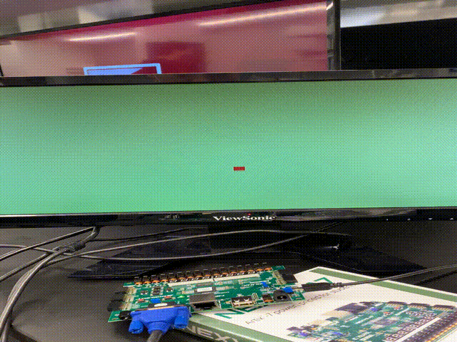

# Lab 3: Bouncing Ball

* Program the FPGA to display a "bouncing ball" on a 800x600 [Video Graphics Array](https://en.wikipedia.org/wiki/Video_Graphics_Array) (VGA) monitor (See Section 8 on VGA Port and Subsection 8.1 on VGA System Timing of the [Reference Manual]( https://reference.digilentinc.com/_media/reference/programmable-logic/nexys-a7/nexys-a7_rm.pdf))

1. Create a new RTL project called vgaball
2. Run the Synthesis
3. Run implementation and open implemented design

4. Generate the bitstream and program the device

5. Create modifications to change the size and color of the vall, ball from square to round, introduce x motion

