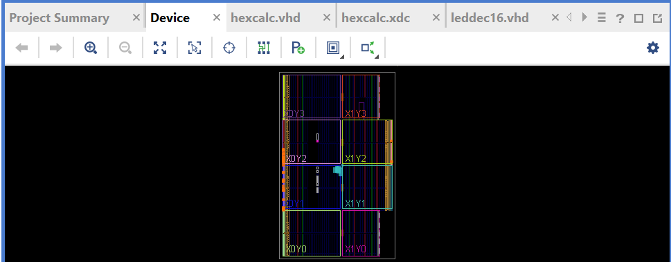

# Lab 4: Hex Calculator

* Program the FPGA on the Nexys A7-100T board to function as a simple hexadecimal calculator capable of adding and subtracting four-digit hexadecimal numbers using a 16-button keypad module ([Pmod KYPD](https://store.digilentinc.com/pmod-kypd-16-button-keypad/)) connected to the Pmod port JA (See Section 10 of the [Reference Manual](https://reference.digilentinc.com/_media/reference/programmable-logic/nexys-a7/nexys-a7_rm.pdf)) directly or via an optional [2x6-pin cable](https://digilent.com/shop/2x6-pin-pmod-cable/) with three dots (or VDD/GND) facing up on both ends

### 1. Create a new RTL project _hexcalc_ in Vivado Quick Start

* Create three new source files of file type VHDL called **_keypad_**, **_leddec16_**, and **_hexcalc_**

* Create a new constraint file of file type XDC called **_hexcalc_**

* Choose Nexys A7-100T board for the project

* Click 'Finish'

* Click design sources and copy the VHDL code from keypad.vhd, leddec16.vhd, and hexcalc.vhd

* Click constraints and copy the code from hexcalc.xdc

### 2. Run synthesis

### 3. Run implementation and open implemented design

### 4. Generate bitstream, open hardware manager, and program device

* Click 'Generate Bitstream'

* Click 'Open Hardware Manager' and click 'Open Target' then 'Auto Connect'

* Click 'Program Device' then xc7a100t_0 to download hexcalc.bit to the Nexys A7-100T board

### 5. Use keypad and buttons

* Enter a multi-digit hex number using the keypad one character at a time to appear on the 7-segment displays

* Enter the first operand, press the “+” key (BTNU)

* Enter the second operand and press the “=” key (BTNL) so that the value of the sum of the operands appears on the display

* Press the “clear” key (BTNC) to set the result on the display to zero

### 6. Edit code with the following [modifications](https://github.com/kevinwlu/dsd/tree/master/Nexys-A7/Lab-4/Modifications)

#### A) Edit the leddec16 module to perform leading zero suppression

* With the leading zeros suppressed, the number “0023” appears as “23” 

* Hint: You can turn off any digit in the display by never taking its anode to ‘0’

* Modify the “anode <=” conditional assignment statement in leddec16 so that it only turns on a particular digit if it is non-zero or if there is non-zero information in the higher order digits of the data word

#### B) Expand the calculator to also do subtraction operations

* Use the button BTND (pin P18 on the Nexys A7-100T board) as the “–” key

* Hint: Modify the ENTER_ACC state to also test for the “–” key being depressed

* Create a new signal to record whether the “+” key or the “–” key was pushed

* Then, when in state ENTER_OP and the “=” key is pressed, test the new signal to determine whether to do an addition or a subtraction

### 7. Close project

* File > Close Project